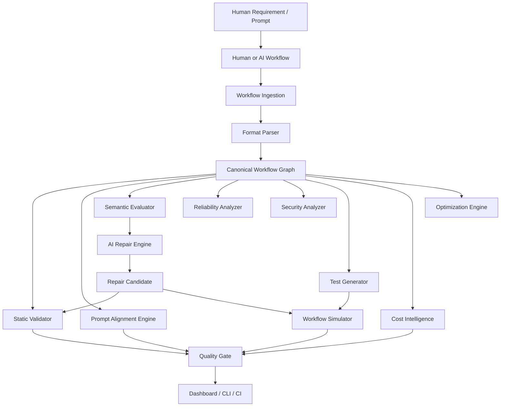

# WorkflowGuard Architecture

## Scope

Part 1 established a production-oriented foundation for parsing, storing, validating, and visualizing workflow graphs. Part 2 added semantic evaluation and prompt alignment without changing the deterministic validation contract. Part 3 added automated workflow QA: test generation, safe simulation, assertions, failure injection, coverage, and persisted test history. Part 4 added cost intelligence, version comparison, and controlled AI-assisted repair. Part 5 completes the product shell with quality gates, reports, audit history, CI/CD examples, observability endpoints, demo assets, and dashboard/repository polish.



## Monorepo Layout

```text
apps/
  api/      FastAPI application, database models, migrations, REST endpoints
  web/      Next.js application, upload UI, dashboard, graph visualization
packages/
  workflow-core/  Canonical models, parsers, graph validation, requirement extraction, semantic evaluation, tests, simulator, costing, comparison, repair, CLI
examples/   Supported and intentionally broken workflow fixtures
docs/       Architecture and operating notes
docker/     Service Dockerfiles
```

## Canonical Workflow Representation

Every supported source format converts into a `Workflow` with:

- stable workflow metadata, source format, source type, optional source prompt
- typed `Node` records with provider-specific configuration and preserved metadata
- typed `Edge` records with source/target references, labels, optional conditions, and metadata
- variables reserved for future workflow engines and test generation

The canonical model is intentionally engine-neutral. Parser-specific data is stored in `metadata` and `configuration` so future analyzers can reason over native details without polluting the common graph contract.

## Parser Architecture

Parsers implement:

- `supports(filename, content, content_type)`
- `validate_source(content)`
- `parse(filename, content, source_type, source_prompt, content_type)`

`ParserRegistry` owns detection and dispatch. Adding UiPath, Temporal, Airflow, LangGraph, Make, Zapier, or additional engines should require a new parser class and registration, not changes to validation rules or API persistence.

## Static Validation

The validation engine builds a NetworkX directed graph from the canonical model, then applies independent rules. Each rule returns structured findings with severity, rule ID, affected node/edge, explanation, and remediation.

The initial Structural Quality Score is deterministic and based on findings plus detectable configuration completeness. It is deliberately separate from future AI quality dimensions.

## Semantic Evaluation

Semantic evaluation is a second layer, not a replacement for static validation. It produces an Overall Workflow Score with dimension scores:

- Structural Validity
- Prompt Alignment
- Reliability
- Security
- Maintainability

The evaluation engine uses:

- deterministic requirement extraction as a baseline
- optional AI-assisted requirement extraction through a provider-neutral interface
- schema validation for every AI-produced `RequirementSpec`
- canonical graph matching for required actions, ordering, conditions, approvals, integrations, and outputs
- deterministic security, reliability, and maintainability analyzers

Every evaluation finding is explainable: expected behavior, observed behavior, reason, location, remediation, and confidence.

## AI Provider Boundary

The API owns provider adapters. The core evaluation and testing engines do not depend on an AI vendor. `WORKFLOWGUARD_AI_PROVIDER=none` runs the system in deterministic mode. `openai` can be configured with `WORKFLOWGUARD_AI_API_KEY`, `WORKFLOWGUARD_AI_MODEL`, and `WORKFLOWGUARD_AI_TIMEOUT_SECONDS`.

Provider timeouts, malformed responses, credential failures, rate limits, and request errors are handled gracefully and fall back to deterministic requirement extraction, deterministic test generation, and deterministic repair patches. Raw model output is never trusted or stored without schema validation.

## Workflow QA

Part 3 introduces `workflow_core.testing`:

- `WorkflowTest`: reusable tests with input data, mocks, failure injection, expected path/output/side effects, assertions, tags, importance, rationale, and linked requirements
- `DeterministicTestGenerator`: graph- and requirement-driven generation for happy paths, branches, edge cases, dependency failures, LLM failure modes, and adversarial prompt-injection cases
- `WorkflowSimulator`: safe canonical-graph runtime that uses controlled adapters for trigger, transform/action, condition, LLM, HTTP/API, database, human approval, email, generic action, and end nodes
- `AssertionEngine`: extensible assertions for executed nodes/edges, outputs, errors, retries, approvals, external calls, and successful termination
- `CoverageCalculator`: workflow coverage across nodes, edges, branches, and requirements
- `WorkflowTestRunner`: combines simulation, assertions, status calculation, duration, failures, and coverage contribution

External integrations are mocked by default. Failure injection models timeouts, rate limits, HTTP 500s, authorization errors, unavailable dependencies, and malformed LLM output without calling real services or executing uploaded code.

The `workflowguard` CLI exposes `validate`, `evaluate`, and `test` commands with stable exit codes for future GitHub Actions use.

## Cost Intelligence

Part 4 introduces `workflow_core.costing`:

- `PricingEntry`: editable/versioned pricing assumptions with provider, model, effective date, unit costs, currency, source, and metadata
- `CostScenario`: executions/day or month, payload size, token estimates, and failure/retry rate
- `CostEstimator`: per-node and per-run estimates, projected daily/monthly/annual totals, and line-item pricing assumptions
- `CostOptimizationEngine`: deterministic optimization findings for repeated LLM calls, expensive models used for simple tasks, duplicate API calls, excessive retries, and large repeated model context

Pricing seed data is deliberately labeled as a development assumption. It is not hardcoded into estimation logic; API persistence can store updated catalog entries.

## Version Comparison

`workflow_core.comparison` compares canonical workflow versions for added/removed nodes, added/removed edges, configuration changes, and score/cost/coverage deltas where the API has stored history. Repair acceptance uses this mechanism to make behavior changes visible.

## Repair

Part 4 introduces `workflow_core.repair` and API repair services:

- AI repair providers generate schema-validated `RepairPatch` objects.
- Deterministic repair fallback proposes bounded timeout/retry configuration.
- Patches apply only to an in-memory candidate for preview.
- Preview runs static validation, semantic evaluation, generated tests, and cost estimation.
- Accepting a proposal creates a new workflow version; rejecting keeps history without mutating the workflow.

Safety checks flag new external destinations, approval removal, and node removal. Uploaded source files and existing tests are not rewritten or deleted.

## Persistence

PostgreSQL stores:

- workflows
- workflow versions
- raw uploaded files
- canonical nodes
- canonical edges
- validation runs
- validation findings
- requirement specifications
- evaluation runs
- evaluation findings
- dimension scores
- workflow tests
- workflow test runs
- pricing catalog
- cost scenarios
- cost estimates
- optimization findings
- repair proposals
- repair validation results
- quality gate runs
- audit events

The schema leaves room for future tables such as execution logs, observability events, alerts, and deployment environments.

## API

FastAPI exposes upload, filtered list, detail, graph, validation, semantic evaluation, requirements, test generation, test creation, test execution, test history, pricing, cost estimation, version comparison, repair proposal/accept/reject, quality gates, history, reports, versions, dashboard, health, readiness, and metrics endpoints under `/api`. OpenAPI docs are generated automatically at `/docs`.

## Frontend

The Next.js UI is a developer-tool surface:

- Dashboard uses real backend metrics.
- Upload supports drag/drop, source type, and original prompt capture.
- Workflow detail shows overview, React Flow graph, validation findings, canonical source, and version context.
- Workflow detail shows AI Evaluation with overall/dimension scores, requirement-vs-implementation evidence, grouped findings, and evaluation history.
- Workflow detail shows Tests with generation/run controls, total/pass/fail/coverage metrics, generated-test rationale, and stored execution traces.
- Workflow detail shows Cost, Versions / Compare, and Repair panels with scenario controls, line-item assumptions, optimization findings, version diffs, patch previews, safety flags, and accept/reject actions.
- Node type styling distinguishes triggers, actions, conditions, LLMs, human approvals, external APIs, database nodes, and end nodes.

## Security Posture

Part 1 validates extensions and size, parses XML with entity resolution and network access disabled, uses safe JSON decoding, and never executes uploaded content. Secrets are kept out of source and documented via `.env.example`.

Part 2 adds static security findings for embedded credentials, secret-like values, unsafe HTTP endpoints, missing auth configuration, and potential LLM sensitive-data exposure. These checks are explicitly best-effort and do not claim complete security coverage.

Part 3 simulation remains sandboxed at the model level: it never executes uploaded scripts, expressions, or workflow-engine runtime code. External systems are represented through mocks and failure injections.

Part 4 repair is sandboxed at the canonical graph level: model output cannot overwrite stored source files or mutate current versions directly. Accepted proposals create new versions after preview.
